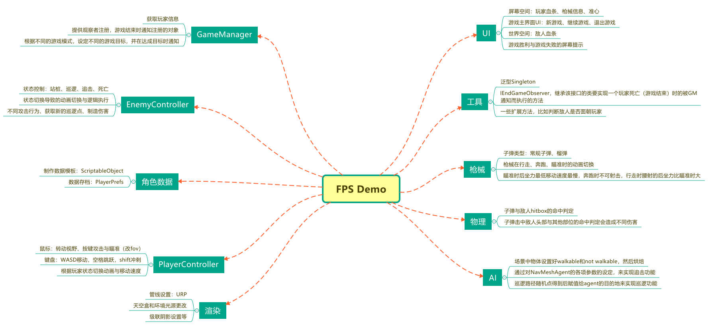

为熟悉Unity的使用，最开始跟着Unity官方的3D教程练了下手，但显然不够。后续为了进一步熟悉Unity各系统功能的使用，跟着网上评价不错且被官方认证的M_Studio的3D RPG课程跟着敲了下代码从而进一步熟悉了Unity各系统的使用，后续打算在此基础上修改玩家控制器，并增加枪械动画等使其成为一个FPS项目。

参考资料：[Unity3D游戏开发教程|Core核心功能01:Create Project 创建项目导入素材｜Unity中文课堂_哔哩哔哩_bilibili](https://www.bilibili.com/video/BV1rf4y1k7vE)

# 项目最终预期目标

## 游戏目标与游戏失败

主菜单进入关卡，目标为限时生存或击杀场景内所有敌人，玩家死亡则游戏失败。

目前已完成：主界面设计，玩家死亡判定及游戏失败判定。不同模式的设计与实现将在5月份完成。

## 敌人类型——已完成（击退效果待FIXME）

- 史莱姆、刺龟：均为近战攻击，有普通攻击和暴击攻击2种不用的伤害和动画。
- 绿巨人：近战，普通攻击和技能攻击，其中一个技能会将玩家击退
- 石头巨人BOSS：近战会将玩家击退，技能范围内会投掷石头将玩家击退和造成眩晕效果。
- AI：玩家进入视野后会追击玩家、玩家脱战后敌人原地观察一会后回到巡逻或站桩状态。

目前已完成：前述所有功能，但由于目前玩家控制器不是FPS游戏的控制器，所以部分判定并不严谨（即有时攻击没有产生对应的效果）。

## 玩家操控与攻击方式——已完成

目标是玩家控制角色能走、跳、射击，并且能发射普通子弹或者榴弹等其他功能性子弹。

目前暂未完成相关功能。剩余功能预计在5月份内完成。

## UI

有开始游戏页面、暂停页面、胜利或失败页面

有角色和敌人的血条、准心、当前武器显示（已完成）

目前已完成：角色和敌人血条显示。剩余功能预计在5月份内完成。

# 框架结构设计图

# 模块录屏

[敌人追击、脱战、血条显示、玩家死亡.mp4](./敌人追击、脱战、敌人血条显示、玩家死亡.mp4)
